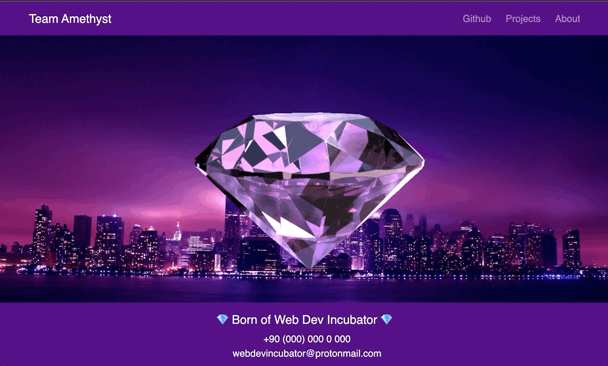

# amethyst-page
## Portfolio and Info Page for Team Amythest

Our webpage to show you what we are all about. View our work and who we are in one conveinent place.

Built With:

- HTML
- CSS
- Bootstrap Library

###Team Resources

#### Git Cheat Sheet

[https://education.github.com/git-cheat-sheet-education.pdf](https://education.github.com/git-cheat-sheet-education.pdf)

---

#### Pull request from fork

[https://docs.github.com/en/pull-requests/collaborating-with-pull-requests/proposing-changes-to-your-work-with-pull-requests/creating-a-pull-request-from-a-fork](https://docs.github.com/en/pull-requests/collaborating-with-pull-requests/proposing-changes-to-your-work-with-pull-requests/creating-a-pull-request-from-a-fork)

---

#### Simple/basic Markdown guide

[https://www.markdownguide.org/cheat-sheet/](https://www.markdownguide.org/cheat-sheet/)
